# Entity-Relationship Diagram — FPL Clone

Generated from the live [`schema.prisma`](../schema.prisma). This is the authoritative relationship map for the database layer.

**19 models** · **7 enums** · Source of truth: `schema.prisma` (not this file — regenerate if the schema changes).

---

## Model groups

| Group | Models | Notes |
|---|---|---|
| Phase 0 core | `User`, `Team`, `Squad`, `Player`, `RealTeam`, `Fixture`, `Gameweek`, `PlayerGameweekStats`, `League`, `LeagueMembership`, `Transfer`, `ChipUsage` | Original roadmap entities |
| Scoring / snapshots | `SquadGameweekSnapshot`, `TeamGameweekScore`, `RecalculationLog` | Derived/cached scoring data |
| Admin / ops | `AuditLog`, `SyncLog`, `AlertConfig` | Audit trail, ingestion logs, alert config |
| Reference extras | `PlayerPriceHistory` | Price change history per player |

**Deferred (not in schema):** `H2HFixture` — HEAD_TO_HEAD enum exists but league creation blocked in `leagues.rules.ts`; classic leagues fully implemented (see [`decisions.md`](decisions.md) § League tables).

---

## Full ER diagram

```mermaid
erDiagram
    User ||--o{ Team : owns
    User ||--o{ LeagueMembership : joins
    User ||--o{ AuditLog : adminActions
    User ||--o{ RecalculationLog : triggers

    Team ||--o{ Squad : has
    Team ||--o{ Transfer : makes
    Team ||--o{ ChipUsage : uses
    Team ||--o{ LeagueMembership : enters
    Team ||--o{ SquadGameweekSnapshot : snapshots
    Team ||--o{ TeamGameweekScore : scores

    Player }o--|| RealTeam : club
    Player ||--o{ Squad : inSquad
    Player ||--o{ PlayerGameweekStats : stats
    Player ||--o{ PlayerPriceHistory : priceHistory
    Player ||--o{ SquadGameweekSnapshot : snapshotted
    Player ||--o{ Transfer : transferIn
    Player ||--o{ Transfer : transferOut

    RealTeam ||--o{ Fixture : homeTeam
    RealTeam ||--o{ Fixture : awayTeam

    Gameweek ||--o{ Fixture : schedules
    Gameweek ||--o{ PlayerGameweekStats : period
    Gameweek ||--o{ Transfer : during
    Gameweek ||--o{ SquadGameweekSnapshot : period
    Gameweek ||--o{ TeamGameweekScore : period
    Gameweek ||--o{ RecalculationLog : recalculated

    League ||--o{ LeagueMembership : members

    User {
        string id PK
        string email UK
        Role role
        boolean isSuspended
        boolean twoFactorEnabled
    }

    Team {
        string id PK
        string userId FK
        string season
        int bankBalance
        int squadValue
        int totalPoints
        int freeTransfers
    }

    Squad {
        string id PK
        string teamId FK
        string playerId FK
        Position position
        boolean isStarter
        int benchOrder
        boolean isCaptain
        boolean isViceCaptain
    }

    Player {
        string id PK
        int fplId UK
        string realTeamId FK
        Position position
        int price
        boolean isAvailable
    }

    RealTeam {
        string id PK
        int fplId UK
        string name
        string shortName
        string crestUrl
    }

    Gameweek {
        string id PK
        int number UK
        GameweekStatus status
        datetime deadline
    }

    Fixture {
        string id PK
        int fplId UK
        string gameweekId FK
        string homeTeamId FK
        string awayTeamId FK
        int homeDifficulty
        int awayDifficulty
    }

    PlayerGameweekStats {
        string id PK
        string playerId FK
        string gameweekId FK
        int points
    }

    League {
        string id PK
        string name
        string inviteCode UK
        LeagueType type
        string adminUserId
        string season
        datetime createdAt
    }

    LeagueMembership {
        string id PK
        string leagueId FK
        string userId FK
        string teamId FK
        datetime joinedAt
    }

    Transfer {
        string id PK
        string teamId FK
        string playerInId FK
        string playerOutId FK
        string gameweekId FK
        int pricePaid
    }

    ChipUsage {
        string id PK
        string teamId FK
        ChipType chipType
        int gameweekNumber
        string season
        int wildcardNumber
        json squadBackup
    }

    SquadGameweekSnapshot {
        string id PK
        string teamId FK
        string gameweekId FK
        string playerId FK
    }

    TeamGameweekScore {
        string id PK
        string teamId FK
        string gameweekId FK
        int startersPoints
        int captainBonus
        int benchPoints
        int transferHit
        int totalPoints
    }

    PlayerPriceHistory {
        string id PK
        string playerId FK
        int price
    }

    AuditLog {
        string id PK
        string adminId FK
        string targetType
        string targetId
    }

    RecalculationLog {
        string id PK
        string gameweekId FK
        string triggeredBy FK
        string type
        int teamsAffected
    }

    SyncLog {
        string id PK
        SyncType syncType
        boolean success
    }

    AlertConfig {
        string id PK
        AlertType alertType UK
        boolean enabled
    }
```

---

## Enums

| Enum | Values |
|---|---|
| `Role` | `USER`, `ADMIN` |
| `Position` | `GK`, `DEF`, `MID`, `FWD` |
| `ChipType` | `WILDCARD`, `FREE_HIT`, `BENCH_BOOST`, `TRIPLE_CAPTAIN` |
| `LeagueType` | `CLASSIC`, `HEAD_TO_HEAD` |
| `GameweekStatus` | `UPCOMING`, `LIVE`, `FINISHED` |
| `SyncType` | `ALL`, `TEAMS`, `PLAYERS`, `FIXTURES`, `GAMEWEEKS` |
| `AlertType` | `INGESTION_FAILURE`, `QUEUE_BACKUP`, `HIGH_ERROR_RATE` |

---

## Composite unique constraints

| Model | Constraint | Purpose |
|---|---|---|
| `Team` | `(userId, season)` | One fantasy team per user per season |
| `Squad` | `(teamId, playerId)` | No duplicate player in same squad |
| `PlayerGameweekStats` | `(playerId, gameweekId)` | Idempotent scoring writes |
| `LeagueMembership` | `(leagueId, userId)` | One membership per user per league |
| `LeagueMembership` | `(leagueId, teamId)` | One team entry per league |
| `SquadGameweekSnapshot` | `(teamId, gameweekId, playerId)` | Idempotent snapshot rows |
| `TeamGameweekScore` | `(teamId, gameweekId)` | Idempotent score recalculation |
| `ChipUsage` | `(teamId, chipType, season, wildcardNumber)` | One chip use per type per season (wildcard #1 vs #2 via `wildcardNumber`) |
| `AlertConfig` | `(alertType)` | One config row per alert type |

---

## Standalone models (no FK relations)

| Model | Role |
|---|---|
| `SyncLog` | Ingestion job audit trail |
| `AlertConfig` | Admin webhook alert configuration |

`League.adminUserId` stores the creator's user ID but is **not** declared as a Prisma relation — membership is tracked via `LeagueMembership` instead.

---

## Relationship notes (differs from early planning docs)

- **User → Team** is **1:N per season** (`@@unique([userId, season])`), not strict 1:1.
- **ChipUsage** links to `Team` only — scoped by `gameweekNumber` + `season`, not a `gameweekId` FK.
- **LeagueMembership** also FKs `teamId` — a league entry is tied to a specific fantasy team.
- **Transfer** has two player FKs: `playerInId` and `playerOutId`.

See [`decisions.md`](decisions.md) for PK strategy, delete conventions, cascade rules, reference data (Phase 2), squad tables (Phase 3), scoring tables (Phase 4), transfer tables (Phase 5), chip tables (Phase 6), and league tables (Phase 7).
